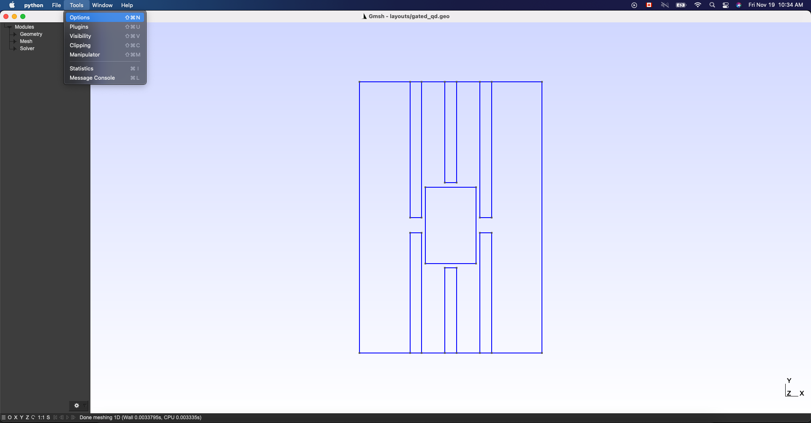
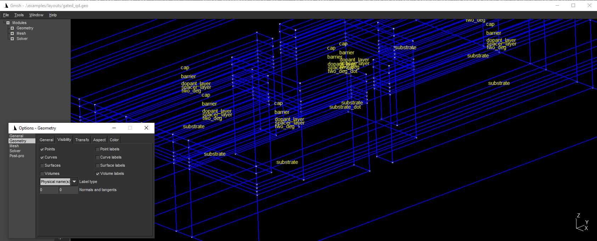

# Device Generator Tutorial

## Requirements

### Software components

- devicegen
- gmsh

### Python script

- [gated_qd.py](../examples/gated_qd.py)

## Briefing

The aim of this tutorial is to demonstrate how the devicegen can be used to accelerate the generation of meshes appropriate for modelling semiconductor nanodevices. Here, the demonstration is made for a gated quantum-dot system. The layout for this example device can be found [here](../examples/layouts/gated_qd.gds). This layout file is in .gds format and can be visualized and modified using, e.g. [KLayout](https://www.klayout.de/).

## Setup

### Header

To generate the mesh for the gated quantum dot using the device generator, we start by importing two relevant modules

``` python
from device_generators.device_gen import DeviceGenerator
import os
```

The first import is the `DeviceGenerator`, while the second is the standard python library `os` which will be used to facilitate referencing separate files.

### Constants

Next we define some constants that will be useful in setting up the device in the subsequent steps. All lengths are given in micrometers, so that we convert from nanometers to micrometers by multiplying by 1e-3.

```python
# Constants
# # Mesh characteristic lengths
char_len = 15 * 1e-3
dot_char_len = char_len/2

# # z dimensions
# # # Thickness of each material layer
cap_thick = 10 * 1e-3
barrier_thick = 25 * 1e-3
dopant_thick = 5 * 1e-3
two_deg_thick = 5 * 1e-3
substrate_thick = 100 * 1e-3 - two_deg_thick

# # # Number of mesh points along growth axis
cap_layers = 10
barrier_layers = 5
dopant_layers = 10
two_deg_layers = 10
substrate_layers = 10
```

### Load layout

The final step of the setup is to load the layout of the device in the `DeviceGenerator`. The layout can be imported as either a .geo file or a .gds file saved with the .txt extension. In this example we will load the gds file found [here](../examples/layouts/gated_qd.gds). Saving a layout into gds text files should be straightforward with most layout editors. For example, in KLayout, this is done using File > Save As by selecting GDS2 Text files in the drop-down menu `'Type'` under the file name field.

``` python
# Initializing the DeviceGenerator
script_dir = os.path.dirname(__file__)
file = script_dir + '/layouts/gated_qd.txt'
dG = DeviceGenerator(file, outfile='layouts/gated_qd.geo', h=char_len)
```

The constructor `DeviceGenerator` has one required argument and multiple optional arguments. The only required argument is the path to the file containing the layout. In our case, it is the .gds file store in `file`.
If a .gds file is loaded, the `DeviceGenerator` automatically creates a corresponding .geo file, named `parsed.geo` by default, containing the same information. The path and the the name of the output .geo file can be specified in the optional input `outfile`. The optional input `h` controls the characteristic length of the mesh generated over the layout. The characteristic lengths at different points can further be altered later on using e.g. the `new_box_field` method of the `DeviceGenerator` (see [device_gen.py](../device_generators/device_gen.py)).  

The layout can be viewed within the `gmsh` GUI by running 

```python
# visualization
dG.view()
```


## Creating a dot region

The `DeviceGenerator` allows users to create rectangles in the layout where they expect a quantum dot to be formed. This is achieved using the `new_dot_rectangle` method.

```python
# Dot rectangle coordinates in microns
dot_xmin = 0.16900;  dot_ymin = 0.23100
dot_len_x = 0.131; dot_len_y = 0.197
dG.new_dot_rectangle(dot_xmin, dot_ymin, dot_len_x, dot_len_y, 
    h=dot_char_len)
```

This method has four arguments and an optional argument. The arguments are the minimal x and y values of the 'dot rectangle' and its length in the x and y directions. In this example, these are given by the constants: `dot_xmin`,  `dot_ymin`, `dot_len_x`, and `dot_len_y`, respectively. Recall that the units of length used by the device generator are microns. Finally there is also the optional input `h` which sets the characteristic length of the mesh within the dot rectangle.

Again, we can visualize the model thus far with the `view` method.

```python
# Display layout with dot region
dG.view()
```


The `DeviceGenerator` has added a rectangular surface to the layout. Another byproduct of using the `DeviceGenerator` is that all the surfaces have been attributed a name (physical name for those familiar with gmsh). To see the names of each surfaces we can select `Tools > Options`:



The following window should pop up:


from which the `Geometry` tab should be selected. Then, we check the box `Surface labels` and in the drop down menu `Label type` select `Physical name(s)`:


Once these selections have been made, we should see the name of each surface.


We can also visualize the 2D mesh on the layout by pressing the '2' key on the keyboard.


The mesh within the dot region should be twice as fine as outside the dot region.

## Relabelling surfaces

The `relabel_surface` method allows us to relabel the surfaces which have been automatically assigned generic names. Here we distiguish three top gates from three bottom gates.

```python
# Relabelling surfaces
print('Relabelling surfaces...')
dG.relabel_surface('surf2', 'top_gate_1')
dG.relabel_surface('surf3', 'top_gate_2')
dG.relabel_surface('surf1', 'top_gate_3')
dG.relabel_surface('surf6', 'bottom_gate_1')
dG.relabel_surface('surf4', 'bottom_gate_2')
dG.relabel_surface('surf5', 'bottom_gate_3')

# Display layout with relabelled surfaces
dG.view()
```

The first input of the `relabel_surface` method is the old name of the surface and the second input is its new name. This method has additional optional inputs that allows users to set some meta data for each surface which can define the boundary conditions at the surface (see [device_gen.py](../device_generators/device_gen.py).

Using the same procedure described above, the surface labels can be shown to be:


## Setting up heterostructure stack

Now that the 2D geometry has been addressed, we focus on creating the heterostructure stack. This is taken care of using the `new_layer` method.

```python
# Heterostructure stack
print('Setting up heterostructure stack...')
dG.new_layer(cap_thick, cap_layers, label='cap')
dG.new_layer(barrier_thick-dopant_thick, barrier_layers, label='barrier')
dG.new_layer(dopant_thick, dopant_layers, label='dopant_layer', 
    dot_region=True, dot_label="dopant_dot")
dG.new_layer(two_deg_thick, two_deg_layers, label='two_deg',
    dot_region=True, dot_label="two_deg_dot")
dG.new_layer(substrate_thick, substrate_layers, label='substrate', 
    dot_region=True, dot_label="substrate_dot")

# Display heterostructure stack
dG.view()
```

This method has two inputs that indicate how thick each layer is and how fine the mesh is within this layer along the growth direction. This second input is given as an integer which tells the gmsh `extrude` function how many times to copy the layout along the growth direction to create the mesh (see [here](https://gitlab.onelab.info/gmsh/gmsh/-/blob/gmsh_4_8_4/tutorial/python/t2.py) for more details). The optional `label` input allows us to label the volume created by the layer. For some layers we have also specified `dot_region = True` and given a `dot_label`. These optional inputs allow us to separate the dot region in the layers from the rest of the layer and give the dot region a separate label. This could be useful, e.g. if we want to model the dot region differently from the rest of the device (e.g., treating the dot region quantum mechanically but the rest of the device classically). The `new_layer` method has multiple additional optional inputs that may be used to add metadata (such as the material and the doping) to each volume (see [device_gen.py](../device_generators/device_gen.py) for more details).

Following the same steps as when we wanted to display the surface labels, we can also display volume labels. Using the `gmsh` GUI to move around and zoom, it should be clear that the dot volumes in the `dopant`, `two_deg`, and `substrate` layers have a separate name.



## Defining a back gate

We can also set up a back gate surface label using the `label_bottom` method

```python 
print('Setting up back gate...')
dG.label_bottom('back_gate')

# Display final layout
dG.view()
```

This method will label the bottom surface with the string given to it as input.

## Saving the mesh

Finally, we can save the mesh generated from the instructions above to the disk using the `save_mesh` method

```python
# Save mesh
dG.save_mesh(mesh_name = script_dir + '/meshes/gated_dot.msh2')
```

Here the `mesh_name` input gives the path and name of the output mesh.
By default, the output mesh will be saved in a file named `mesh.msh2`. However here we have specified that the output mesh should be saved to the `meshes/` directory under the name `gated_dot.msh2`. The file extension (in this case `.msh2`) will determine under which format the mesh is saved.

## Full code

```python
from device_generators.device_gen import DeviceGenerator
import os

# Constants
# # characteristic lengths
char_len = 15 * 1e-3
dot_char_len = char_len/2

# # z dimensions
# # # Thickness of each material layer
cap_thick = 10 * 1e-3
barrier_thick = 25 * 1e-3
dopant_thick = 5 * 1e-3
two_deg_thick = 5 * 1e-3
substrate_thick = 100 * 1e-3 - two_deg_thick

# # # Number of mesh points along growth axis
cap_layers = 10
barrier_layers = 5
dopant_layers = 10
two_deg_layers = 10
substrate_layers = 10

# Initializing the DeviceGenerator
script_dir = os.path.dirname(__file__)
file = script_dir + '/layouts/gated_qd.txt'
outfile=script_dir + '/layouts/gated_qd.geo'
dG = DeviceGenerator(file, outfile=outfile, h=char_len)

# Display layout
dG.view()

# Dot rectangle coordinates in microns
dot_xmin = 0.16900;  dot_ymin = 0.23100
dot_len_x = 0.131; dot_len_y = 0.197
dG.new_dot_rectangle(dot_xmin, dot_ymin, dot_len_x, dot_len_y, 
    h=dot_char_len)

# Display layout with dot region
dG.view()

# Relabelling surfaces
print('Relabelling surfaces...')
dG.relabel_surface('surf2', 'top_gate_1')
dG.relabel_surface('surf3', 'top_gate_2')
dG.relabel_surface('surf1', 'top_gate_3')
dG.relabel_surface('surf6', 'bottom_gate_1')
dG.relabel_surface('surf4', 'bottom_gate_2')
dG.relabel_surface('surf5', 'bottom_gate_3')

# Display layout with relabelled surfaces
dG.view()

# Heterostructure stack
print('Setting up heterostructure stack...')
dG.new_layer(cap_thick, cap_layers, label='cap')
dG.new_layer(barrier_thick-dopant_thick, barrier_layers, label='barrier')
dG.new_layer(dopant_thick, dopant_layers, label='dopant_layer', 
    dot_region=True, dot_label="dopant_dot")
dG.new_layer(two_deg_thick, two_deg_layers, label='two_deg',
    dot_region=True, dot_label="two_deg_dot")
dG.new_layer(substrate_thick, substrate_layers, label='substrate', 
    dot_region=True, dot_label="substrate_dot")

# Display heterostructure stack
dG.view()

print('Setting up back gate...')
dG.label_bottom('back_gate')

# Display final layout
dG.view()

# Save mesh
dG.save_mesh(mesh_name = script_dir + '/meshes/gated_dot.msh2')
```
